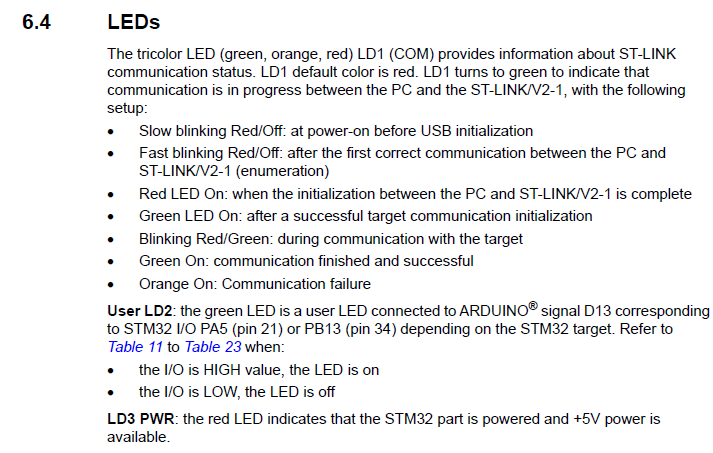
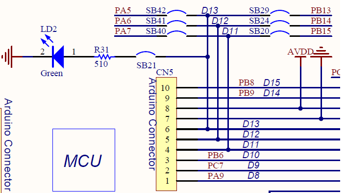
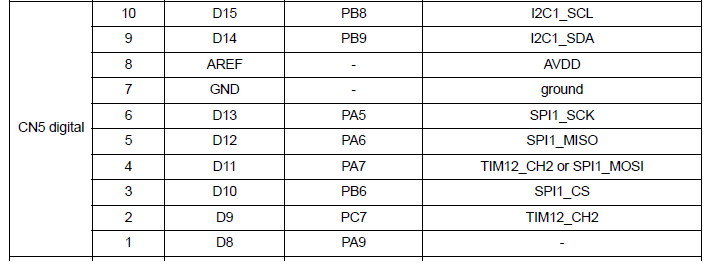
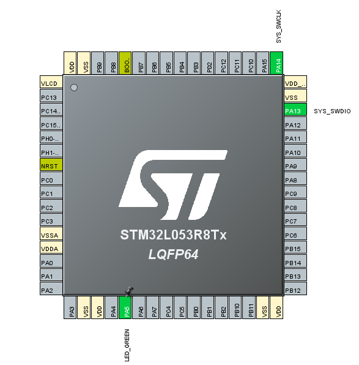
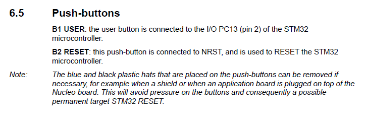
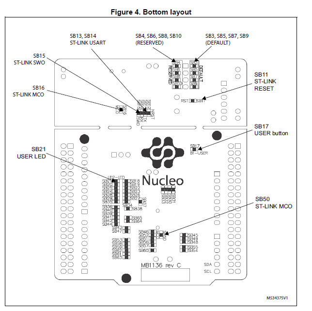
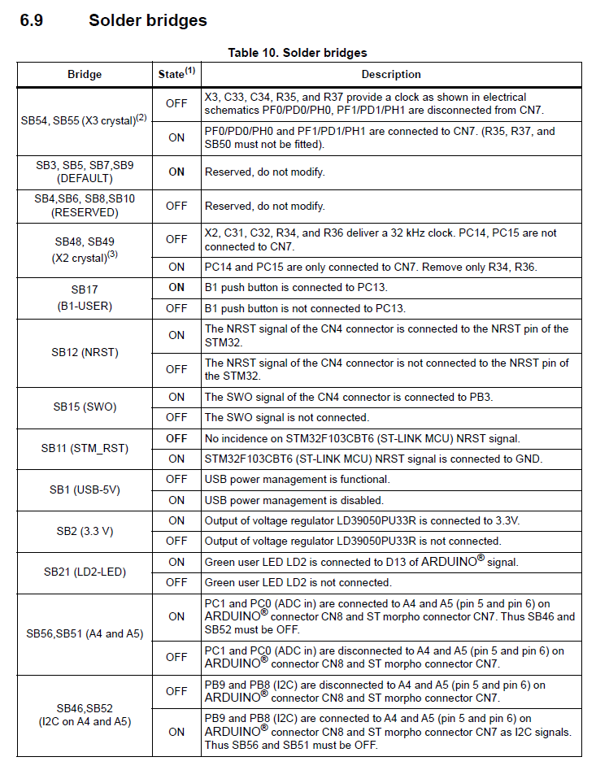
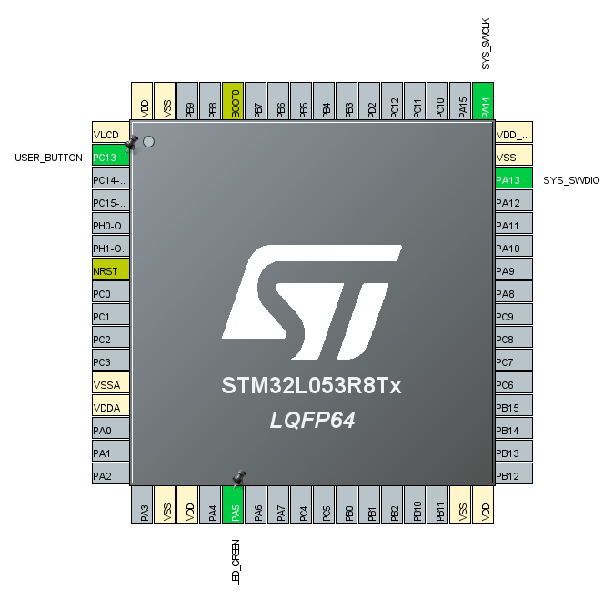
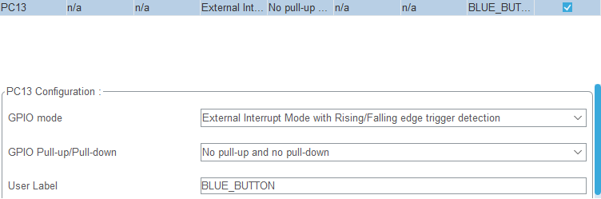
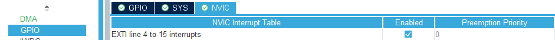

# stm32l053r8t6_hal

## what should I do

* LED
  * on/off
* button exti, gpio input
  * push/pull
* usart
  * printf, transmit
* timer
  * systick callback
* led + timer
  * blink
* led + tim
  * dimming
* button + timer
  * short, long key
* adc
  * mcu temperature
* flash
* eeprom
* custom bootloader
* IWDG
* low power mode
  * sleep, stop, stand-by

## LED

stm32l053r8t6를 포함하는 ev-board의 User manual은 MB1136인데 여기의 정보 중 LEDs정보를 보면 User가 사용 가능 한 LD2에 대한 내용이 나와있다.

PA5(pin21), PB13(pin32)의 경우가 사용 가능한데 여기서 더 정보가 필요하다.

stm32l053r8t6의 schematic을 보면 LED Green 즉, LD2가 PA5나 PB13과 연결된 것을 확인 할 수 있다.

D13의 정보(SB42, SB29)는 ARDUINO connectors의 목록을 보면 알 수 있다.

다음과 같이 stm32l053r8t6쪽을 보면 D13은 PA5에 연결되어 PA5에서만 LD2 LED를 제어 가능하다는 것을 알 수 있다.

따라서 다음과 같이 ioc 설정을 하였다.

PA5를 GPIO_OUTPUT으로 설정하였고, LED_GREEN으로 label을 하였다.

label을 하면 좋은 점은 추후에 pin설정을 바꾸더라고 label로 이름을 똑같이 하면 코드 자체에 label을 따로 수정을 안해도 되는 장점이 있다.

void HAL_GPIO_WritePin(GPIO_TypeDef *GPIOx, uint16_t GPIO_Pin, GPIO_PinState PinState);

: gpio output high/low 설정

__weak void HAL_Delay(uint32_t Delay);

: Delay의 mele second 만큼 동작을 지연

다음과 같은 함수를 이용하여 LED를 0.5초 마다 키고 끄게 동작을 만든다.

코드는 소스를 참고하면 되는데, led.c, led.h를 따로 만들어서 led_on, led_off함수를 통해 gpio설정과 led 상태를 동작하도록 만들었다.

## Button

버튼은 ev-board의 경우 PC13(pin 2)와 연결 되어있음을 ev-board datasheet를 보면 알 수 있다.

ev-board에서의 버튼의 위치는 위와 같고 schematic을 보면 PC13에서 SB17을 통해 연결되어 있는 것을 확인 가능하고 pull-up 저항이 달려있어 버튼이 pull되어있을때는 GPIO_PIN_SET으로 읽힘에 주의해야 한다.

solder bridge를 보면 SB17은 ev-board 종류에 상관없이 존재함을 알 수 있다.

ioc 파일은 다음과 같이 PC13에 EXTI설정을 하고, NVIC등록을 해야 IRQ등록이 되어 동작을 한다.

edge detection은 rising/falling 둘다 받도록 하여 버튼이 push, pull 될때 모두 동작하도록 했다.

동작 시나리오는 button을 누르면 led가 켜지고, button을 떼면 led가 꺼지도록 구성을 하였다.

## USART

ev-board의 경우는 기본적으로 USART2가 virtual COM port로 사용이 가능하다고 나와있다.

schematic을 보면 PA2, PA3로 STLK_TX, STLK_RX가 연결되어있는것을 확인 가능하고, 이는 ioc에서 usart2를 설정하면 사용한 핀들이다

다음과 같이 usart2를 설정하여 PA2, PA3를 활성화 시키고 인터럽트로 usart를 받기 위해 NVIC settings에서 Enabled를 설정한다.

먼저 HAL_UART_RxCpltCallback(UART_HandleTypeDef *huart) 함수를 통해 키 입력을 통해 동작하는 것을 확인한다. pritnf로 출력을 하기 위해서 _write함수를 재정의 해야한다. HAL_UART_Transmit함수를 사용하여 재정의를 하면 printf 출력이 usart로 변경이 된다. 특히, 여기서 개행을 해줘야 출력이 가능한데, 버퍼 설정을 setvbuf함수를 통해 해줘야 shell 동작을 항상 개행 없이 가능하다. 

setvbuf(stdout, NULL, _IONBF, 1024) 설정을 통해 버퍼 없이 동작하도록 하여 입력시마다 출력이 되도록 만들어주고 shell 동작을 구현하였다.

나중에 있을 usb cdc 동작과 shell 동작의 연계를 위해 따로 shell파일와 usart파일을 구분하였다.

shell 명령어의 경우 기본으로 현재의 버전 확인, reset, cls동작을 추가하였다.

## TIMER

