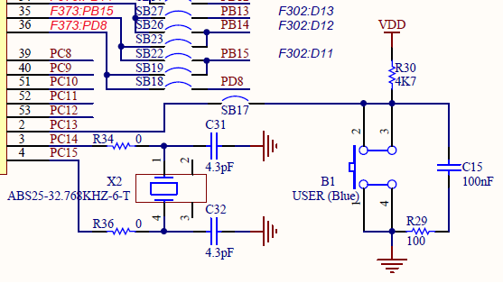

# stm32l053r8t6_hal

## what should I do

* LED
  * on/off
* button exti, gpio input
  * push/pull
* usart
  * printf, transmit
* timer
  * systick callback
* led + timer
  * blink
* led + tim
  * dimming
* button + timer
  * short, long key
* adc
  * mcu temperature
* flash
* eeprom
* custom bootloader
* IWDG
* low power mode
  * sleep, stop, stand-by

## LED

stm32l053r8t6를 포함하는 ev-board의 User manual은 MB1136인데 여기의 정보 중 LEDs정보를 보면 User가 사용 가능 한 LD2에 대한 내용이 나와있다.

PA5(pin21), PB13(pin32)의 경우가 사용 가능한데 여기서 더 정보가 필요하다.

stm32l053r8t6의 schematic을 보면 LED Green 즉, LD2가 PA5나 PB13과 연결된 것을 확인 할 수 있다.

D13의 정보(SB42, SB29)는 ARDUINO connectors의 목록을 보면 알 수 있다.

다음과 같이 stm32l053r8t6쪽을 보면 D13은 PA5에 연결되어 PA5에서만 LD2 LED를 제어 가능하다는 것을 알 수 있다.

따라서 다음과 같이 ioc 설정을 하였다.

PA5를 GPIO_OUTPUT으로 설정하였고, LED_GREEN으로 label을 하였다.

label을 하면 좋은 점은 추후에 pin설정을 바꾸더라고 label로 이름을 똑같이 하면 코드 자체에 label을 따로 수정을 안해도 되는 장점이 있다.

void HAL_GPIO_WritePin(GPIO_TypeDef *GPIOx, uint16_t GPIO_Pin, GPIO_PinState PinState);

: gpio output high/low 설정

__weak void HAL_Delay(uint32_t Delay);

: Delay의 mele second 만큼 동작을 지연

다음과 같은 함수를 이용하여 LED를 0.5초 마다 키고 끄게 동작을 만든다.

코드는 소스를 참고하면 되는데, led.c, led.h를 따로 만들어서 led_on, led_off함수를 통해 gpio설정과 led 상태를 동작하도록 만들었다.

## Button

버튼은 ev-board의 경우 PC13(pin 2)와 연결 되어있음을 ev-board datasheet를 보면 알 수 있다.

ev-board에서의 버튼의 위치는 위와 같고 schematic을 보면 PC13에서 SB17을 통해 연결되어 있는 것을 확인 가능하고 pull-up 저항이 달려있어 버튼이 pull되어있을때는 GPIO_PIN_SET으로 읽힘에 주의해야 한다.

solder bridge를 보면 SB17은 ev-board 종류에 상관없이 존재함을 알 수 있다.

ioc 파일은 다음과 같이 PC13에 EXTI설정을 하고, NVIC등록을 해야 IRQ등록이 되어 동작을 한다.

edge detection은 rising/falling 둘다 받도록 하여 버튼이 push, pull 될때 모두 동작하도록 했다.

동작 시나리오는 button을 누르면 led가 켜지고, button을 떼면 led가 꺼지도록 구성을 하였다.
